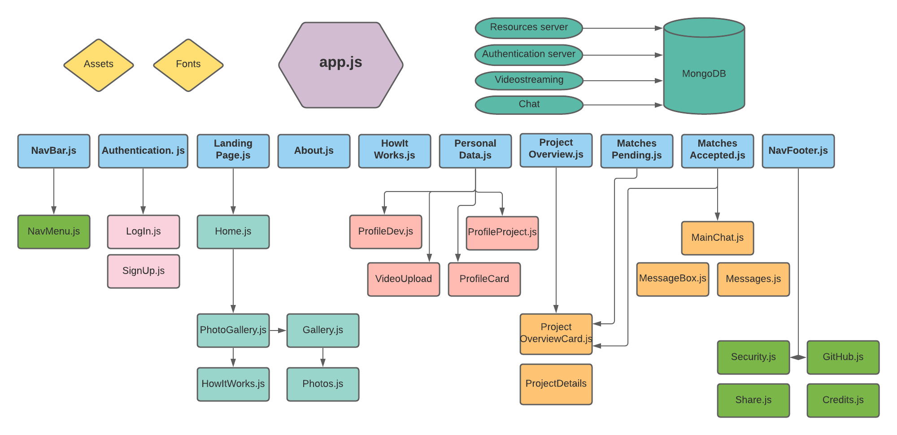

# Code4Sustainability_APP
Frontend with React.js

# Stack
* [Node.js](https://nodejs.org/)
* [REACT.JS](https://reactjs.org/) (User Interface) using functional components 
* JS/JSX (blog logic)
* CSS (external styling)
* GIT/GITHUB (code management)
* [MongoDB](https://www.mongodb.com/de) (NoSQL-datamanagementsystem)

# How to run locally

- System requirements: [Node.js](https://nodejs.org/)
- Fork the repository
- Clone it to your local repo
- Run "npm start" to run local server
- See .env.sample for environment variables

# Structure

# Backend

[Code4Sustainability resources server](https://github.com/Natascha2020/Code4Sustainability_API.git)
[Code4Sustainability authentication server](https://github.com/Natascha2020/Code4Sustainability_Auth.git)
[Code4Sustainability videoStreaming server](https://github.com/Natascha2020/Code4Sustainability_VideoStreaming.git)
[Code4Sustainability chat server](https://github.com/Natascha2020/Code4Sustainability_Chat.git)
